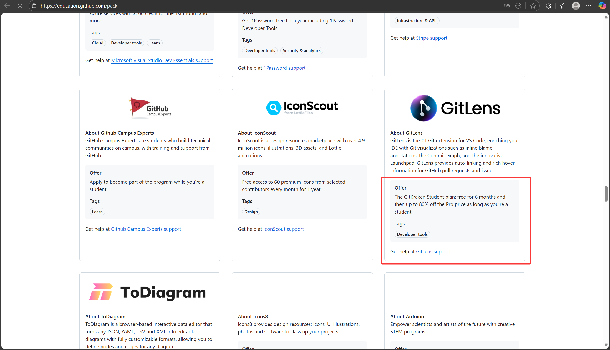

# 如何使用Gitlens的教育优惠  

## 前提条件：你已经获得了GitHub教育包（本文不会教你怎么获得这玩意）  

## 截止至2025.10.22日，教育优惠==可以且仅可以白嫖6个月==，6个月后只是续期有优惠，==无法一直白嫖==  

  
图中的英语意思为：您的学生试用期还剩180天。  
试用期结束后，您将只能在公开托管的仓库上使用Pro功能。  

## 具体步骤  

### 一  

打开[GitHub Student Developer Pack](https://education.github.com/pack)界面，并保持登录状态
未登录时，会显示Sign in  
  
登录后，右上角为你的头像  
  

### 二  

找到Gitlens（建议使用crlt + f搜索）  

在登录状态下，该界面会这样显示  
  
如果这样显示，那就是你还没登录  
  

可以发现未登录时没有"**Get direct access on the GitLens website**"

点击[Get direct access on the GitLens website](https://education.github.com/pack/redeem/gitlens-student)即可进入验证界面  

在弹出的页面中同意授权给Gitlens  
（我这里已经授权过了，弹不出这个界面）  

### 三  

现在你进入到了GitKraken领取学生优惠的界面  
  
点击"**Get Your Free Student**"  

之后怎么操作我无法演示了，因为我现在已经申请成功了，点进去之后的界面与读者的界面显然不同  
如果不懂英语的话就借助AI赋能罢（

## 结尾  

如果不出意外，你已经顺利白嫖了6个月的GitLens的pro功能。  
当然，我是申请成功后根据记忆写的，所以你前面难免会有些意外（  
请见谅  
