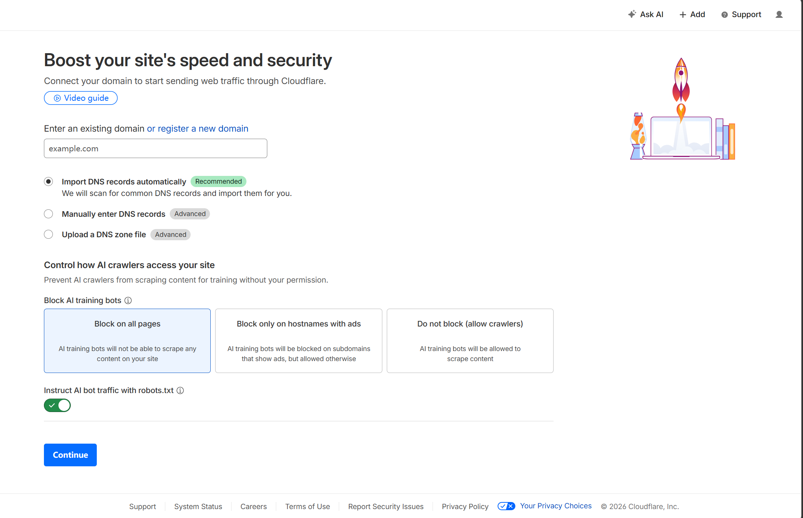
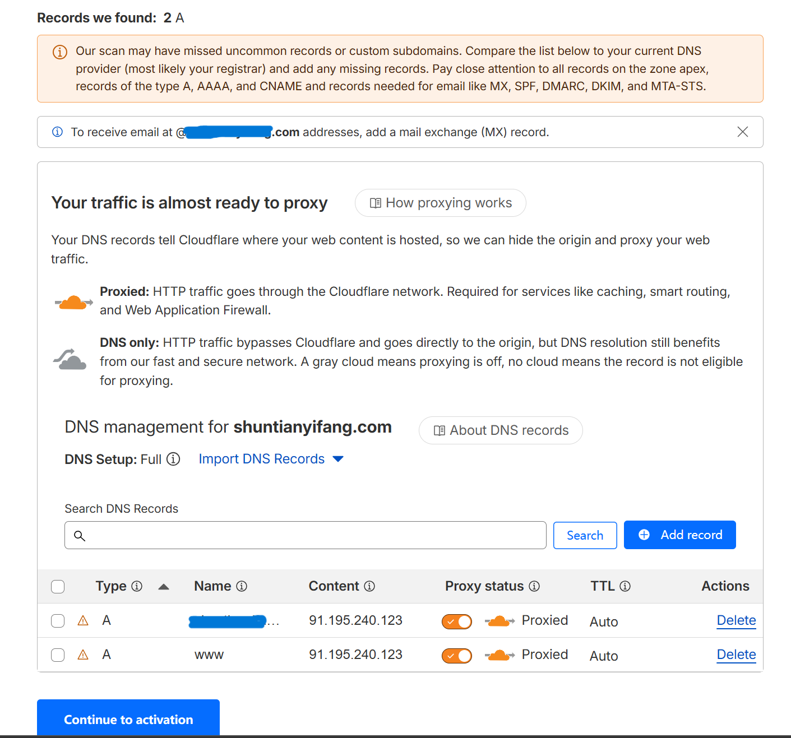
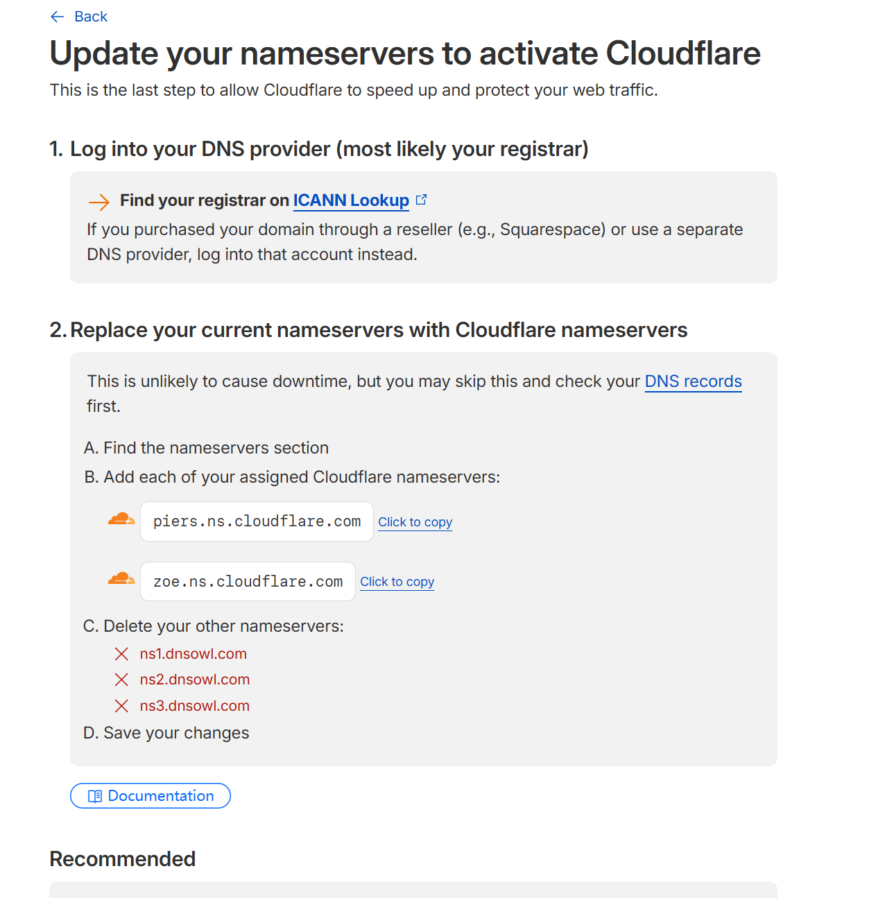
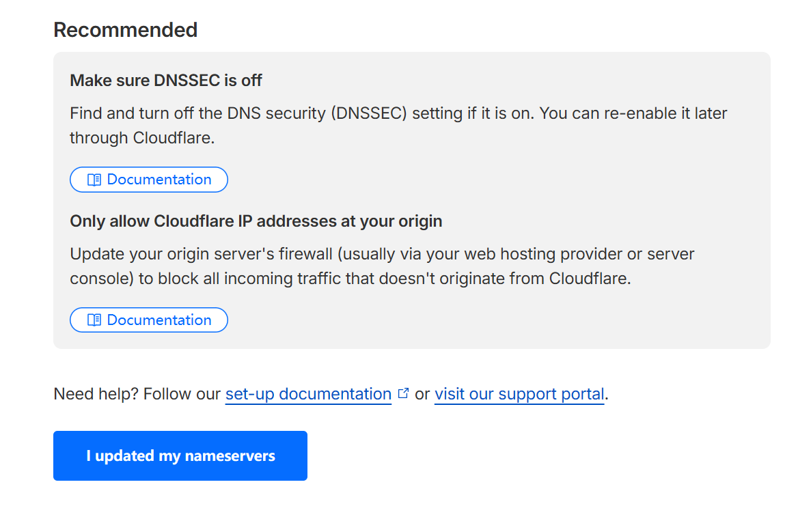
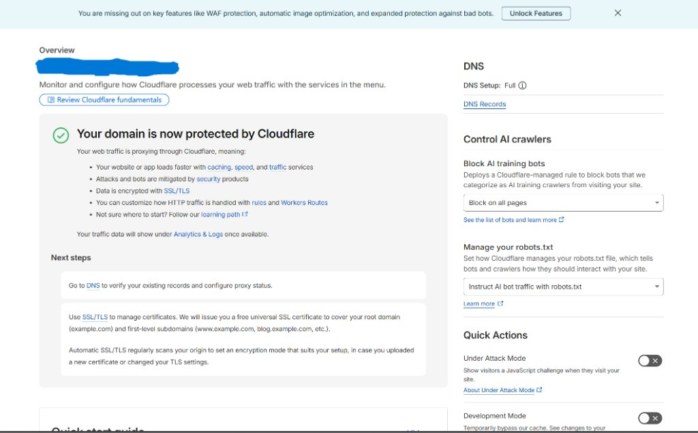

## 前提条件：你已经购买了一个域名，并且已经获得了你所用的 AI 的 API Key  

## 本文所用的域名平台为==NameSilo==  

## 本文所用的 AI 为==Gemini==  

## 如果你用的其他平台或 AI ， 这得看你泛化能力了（  

## 具体步骤  

### 一 给 Cloudflare 托管域名  

登录你的 Cloudflare 控制台。

点击左侧导航栏的 Domains（域名），然后点击右侧的 Onboard a domain（域名添加）。  

然后就会出现这样的界面  


在这个界面，你只需要：  

- 输入你的域名： 在那个写着 example.com 的输入框里，填入你刚刚买好的域名：zhangsan.com（此处只是示例，注意不要加 www. 或者 http://，只填纯域名）。  
- 保持默认选项： 下面的 "Quick scan for DNS records"（快速扫描 DNS 记录）保持默认选中即可。关于拦截 AI 爬虫（AI crawlers）的选项随便选哪个都不影响我们做 API 代理，保持默认就好。  
- 点击继续： 点击页面最下方蓝色的 Continue 按钮。  

随后的页面会让你选套餐，选择 "Free" (免费) 套餐，点击继续。  

选完套餐后，我们会看到这样的界面：  


这是 DNS 记录扫描页面  

这张图里显示的这两条记录（指向 91.195.240.123 的 A 记录），只是 NameSilo 给新域名默认分配的“停放”页面，对我们做 API 代理没有任何影响。  
完全不用管这些记录，直接点击左下角蓝色的 "Continue to activation"（继续以激活） 按钮。  

接着就是这个界面：  


第一张图是在 Cloudflare 讲你需要怎么做，当然这段英文操作我会在下面给你解释成中文听：  

更新您的域名服务器以激活 Cloudflare  
这是允许 Cloudflare 加速和保护您的网络流量的最后一步。  

1. 登录您的 DNS 提供商（很可能是您的域名注册商）  
 在 ICANN Lookup 上查找您的注册商  

    如果您是通过经销商（例如 Squarespace）购买的域名，或者使用的是单独的 DNS 提供商，请登录该对应帐户。  

2. 将您当前的域名服务器替换为 Cloudflare 域名服务器  
 这不太可能导致网站停机，但您可以先跳过此步骤并检查您的 DNS 记录。  

- A. 找到域名服务器（nameservers）设置部分  

- B. 添加分配给您的每一个 Cloudflare 域名服务器：  

  - piers.ns.cloudflare.com （点击复制）  

  - zoe.ns.cloudflare.com （点击复制）  

- C. 删除您的其他域名服务器：  

  - ❌ ns1.dnsowl.com  

  - ❌ ns2.dnsowl.com  

  - ❌ ns3.dnsowl.com  

- D. 保存您的更改  

第二张图是 Cloudflare 给你的建议：  

- 关闭 DNSSEC (Make sure DNSSEC is off)： 如果你之前的注册商开启了 DNSSEC（一种防止 DNS 劫持的安全扩展），在迁移域名服务器时必须先将其关闭，否则会导致你的域名无法访问。等成功接入 Cloudflare 后，你可以再在 Cloudflare 后台重新开启它。  
- 限制源站 IP (Only allow Cloudflare IP addresses...)： 为了防止黑客绕过 Cloudflare 的防护直接攻击你的服务器真实 IP，强烈建议在你的服务器防火墙中设置：只允许 Cloudflare 的 IP 节点访问你的服务器。  

改完之后点击蓝色的 I updated my nameservers  

由于互联网在全球范围内同步这个“控制权转移”的信息需要一点时间（这叫做 DNS 解析生效），我们现在需要稍微耐心等待一下。通常这个过程只需要几分钟，最慢大概半小时。等出现这个界面后这一部分就大功告成了：  


### 二 创造反向代理并绑定域名  

第一步：创建 Worker
在 Cloudflare 的左侧菜单栏里，往下找，点击 Compute，然后就会展开出现 Workers & Pages ，直接点击这玩意  

点击页面右侧的蓝色的 Create application（创建应用程序）按钮。  

在弹出的页面点击中间的那个带绿色小地球图标的选项："Start with Hello World!"。  
这是创建一个纯净版基础 Worker 最简单快捷的方式。  

点击之后，请跟着以下步骤一气呵成：  

- 起个名字并部署： 下一个页面会让你给这个 Worker 命名（Name）。你可以把系统随机生成的名字改成一个好记的，例如 gemini-proxy，然后直接点击右下角蓝色的 "Deploy"（部署）。  

- 进入编辑模式： 部署成功后，页面上会出现一个庆祝画面。找到并点击 "Edit code"（编辑代码） 按钮。  

- 替换代理代码： 进入代码编辑器后，左边会有几行默认的 "Hello World" 代码。把它们全部删掉，一字不留，然后把我们的代理代码粘贴进去：  

```javascript
export default {
  async fetch(request, env) {
    const url = new URL(request.url);
    url.host = 'generativelanguage.googleapis.com';
    const newRequest = new Request(url.toString(), new Request(request));
    return fetch(newRequest);
  }
};
```

如果你使用的其他平台，请咨询下 AI 这里的 url.host = 后面该填什么，因为我现在只懂 Gemini 。

### 三 连接测试  

## 结尾  

如果不出意外，你已经可以直连你AI的API了。  
